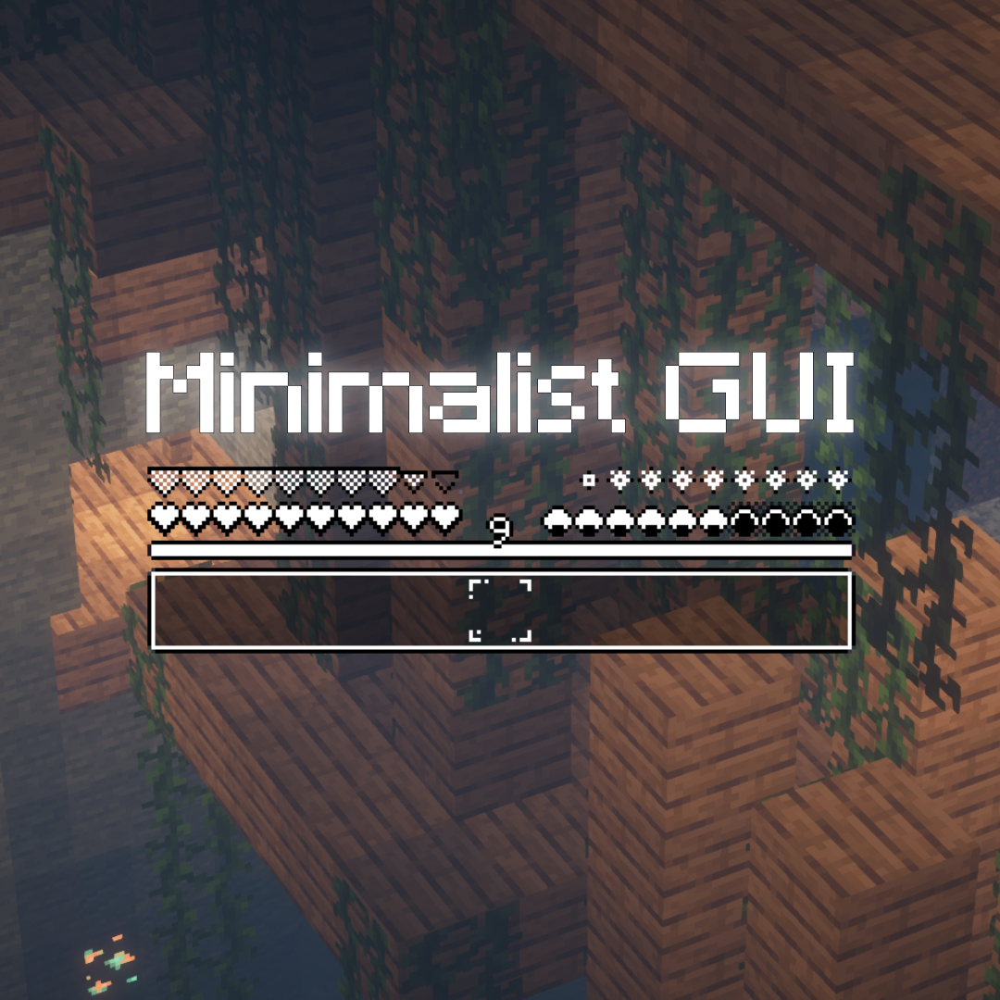
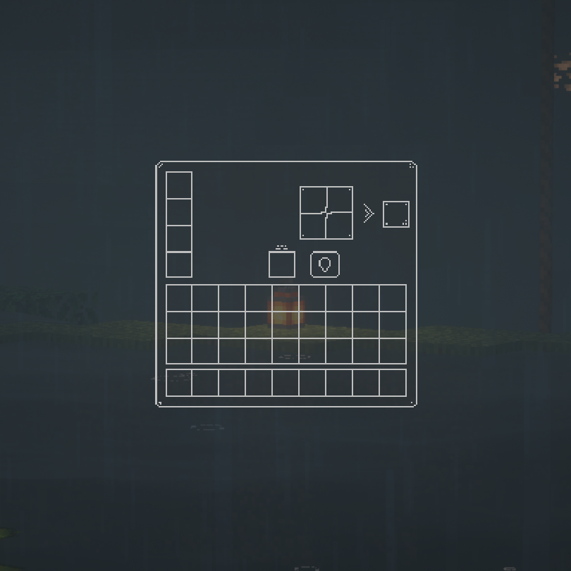
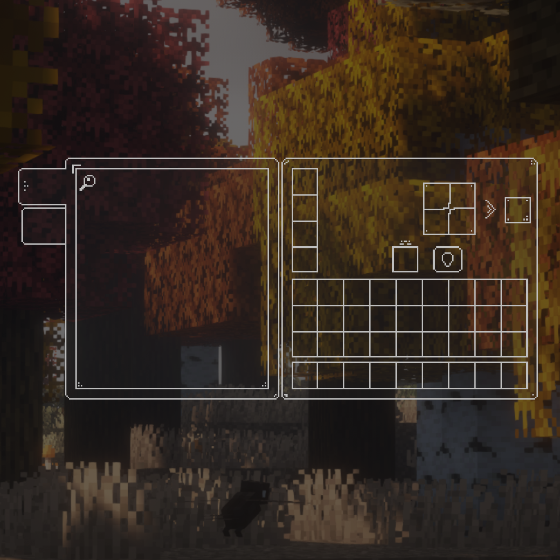
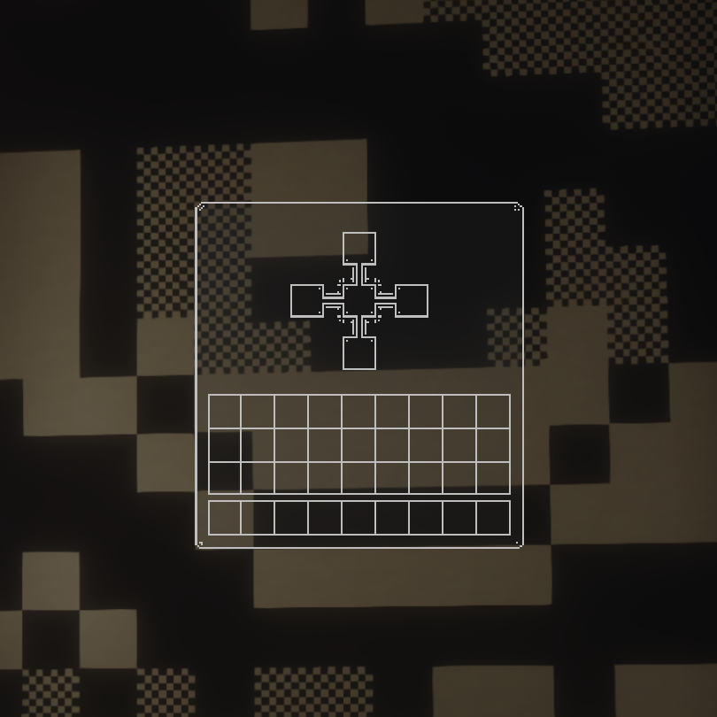
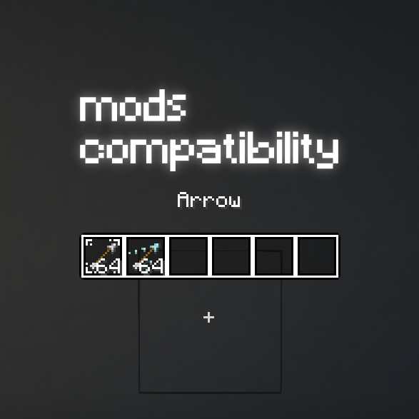

# A minimalist Resource Pack for minecraft is in development. 
 (but it is already functional)

## Mods Compatibility
+ appleskin
+ farmersdelight
+ inventoryhud
+ inventoryprofilesnext
+ parcool
+ supplementaries (quiver)
+ xaeros minimap

